# Doctor Appointment System

## Team Members

<div style="display: flex; justify-content: space-around; align-items: center; margin-top: 20px;">

<div style="text-align: center;">
  
  <h3>Vijaykumar V</h3>
</div>

<div style="text-align: center;">
  
  <h3>Karrupiah C</h3>
</div>

<div style="text-align: center;">
  
  <h3>Sanjai J</h3>
</div>

</div>


## Project Overview
The **Doctor Appointment System** is a web-based application designed to simplify the process of booking and managing doctor appointments. It consists of three main modules:
1. **Patients**
2. **Doctors**
3. **Admin**

Each module provides a specific set of functionalities tailored to the role of the user, ensuring a smooth and efficient user experience.

---

## Modules

### 1. **Patients**
Patients can perform various actions within the system, such as:
- **Search Doctor**: Patients can search for doctors by:
  - Locality
  - Specialization
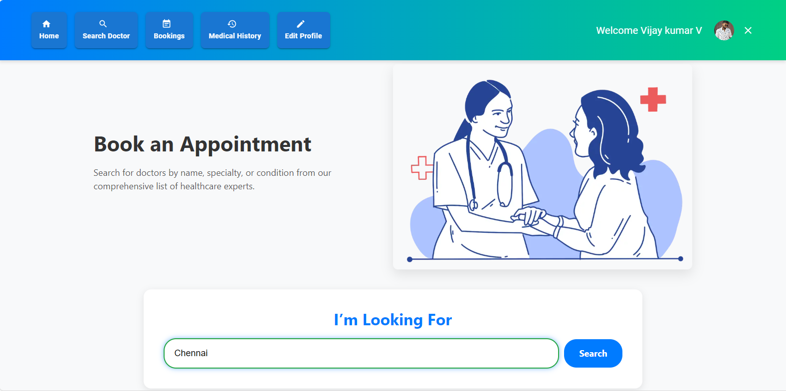
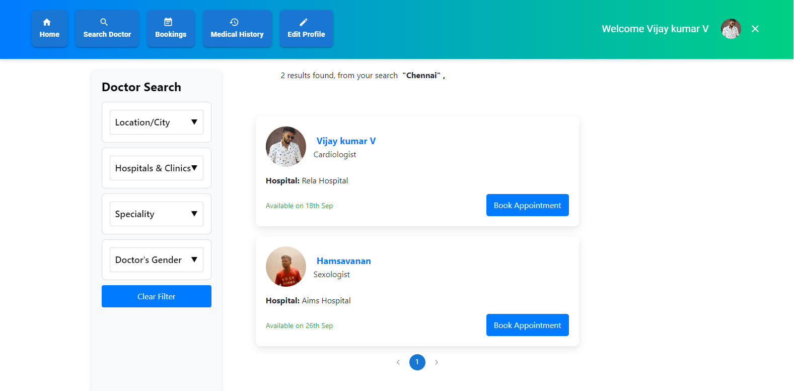

- **Book Appointment**: Patients can book an appointment with a selected doctor.
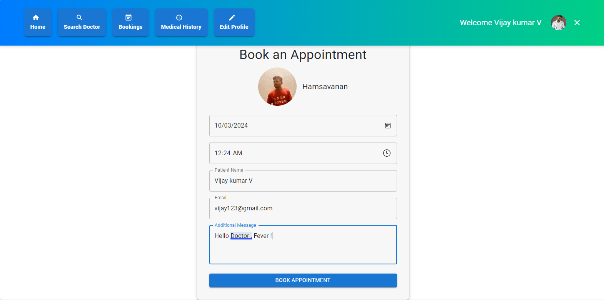

- **View Medical History**: Patients can view their medical history, including previous appointments and prescriptions.
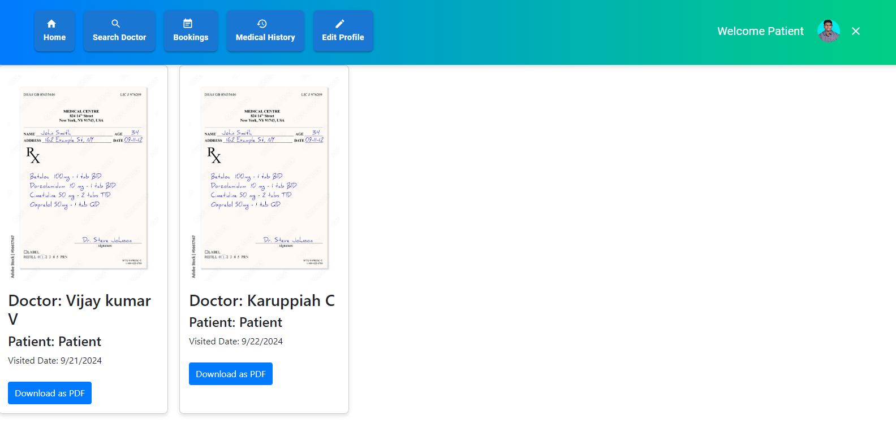

- **Edit Profile**: Patients can update their profile information, such as contact details and personal information.
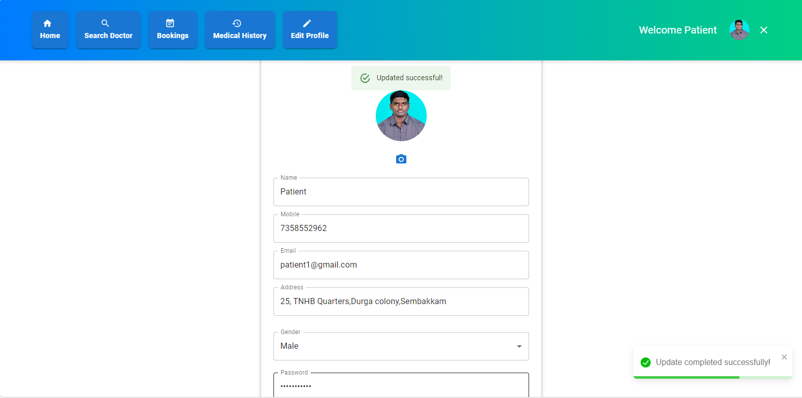

### 2. **Doctors**
Doctors have access to functionalities that help them manage their practice:
- **View Other Doctors**: Doctors can see a list of other doctors registered in the system.
- **Set Available Dates**: Doctors can manage and set their availability for patient appointments.
- **View and Manage Bookings**: Doctors can:
  - See their upcoming and past appointments.
  - Complete patient bookings.
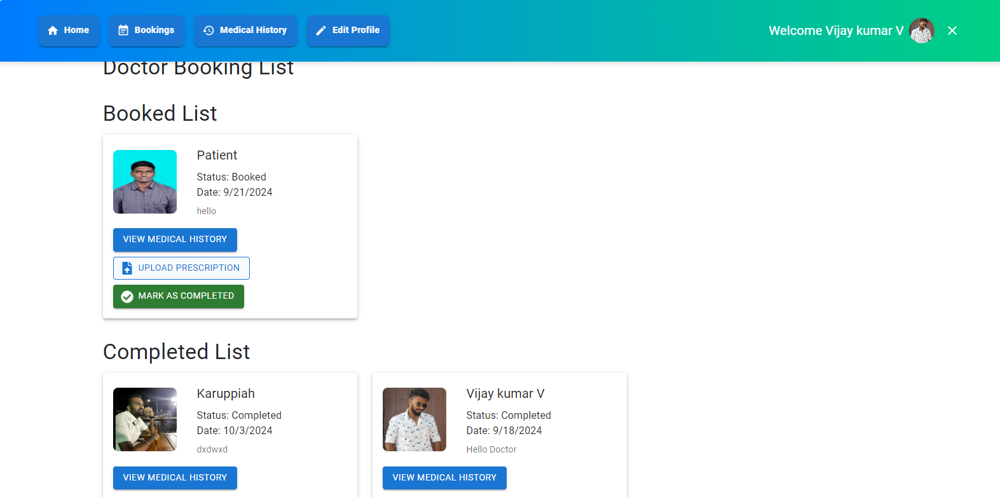

- **Edit Profile**: Doctors can update their personal and professional information.
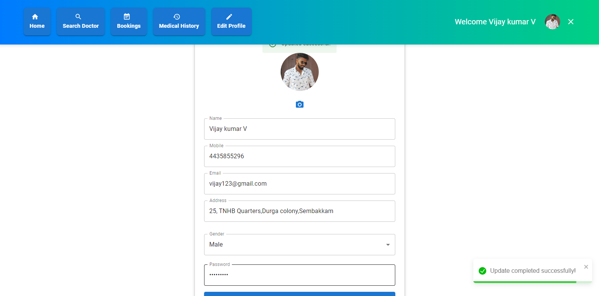

- **View Patient Medical History**: Doctors can access the medical history of patients who have booked an appointment with them.
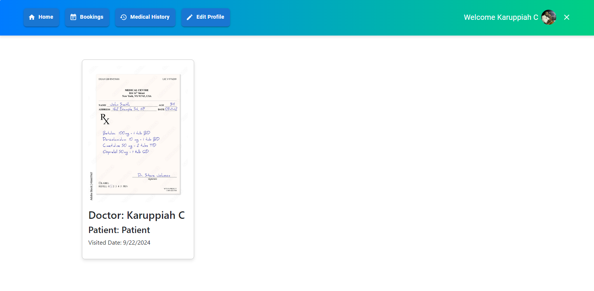

- **Upload Prescription**: After a patient booking, doctors can upload a prescription to mark the appointment as completed.

### 3. **Admin**
The admin dashboard provides complete oversight of the system:
- **Analytics Dashboard**: A visual representation of key statistics, such as:
  - Total number of doctors and patients.
  - Appointment statistics (pending, booked, completed).
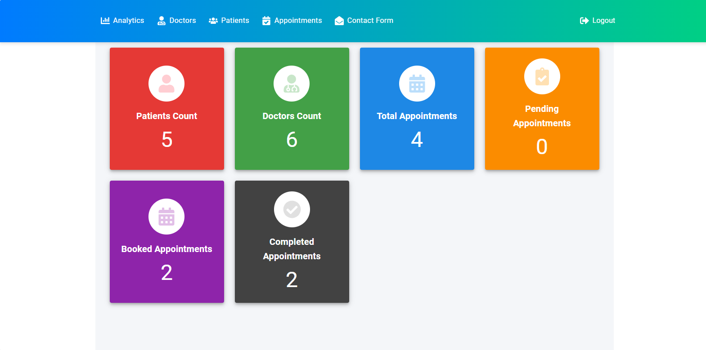

- **Doctors List**: Admins can view and manage all registered doctors.
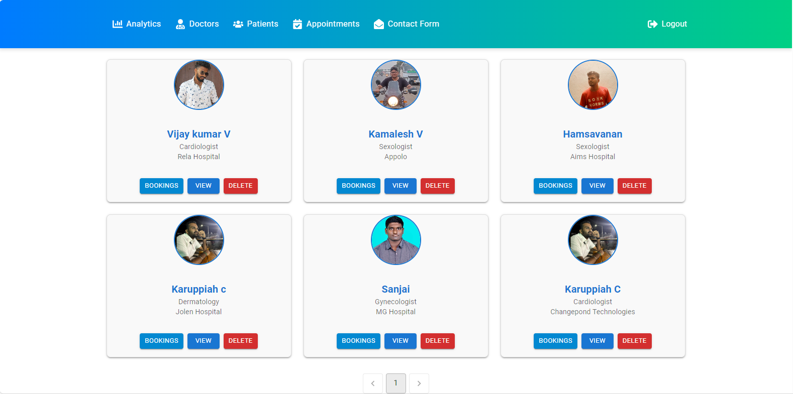

- **Patients List**: Admins can view and manage all registered patients.
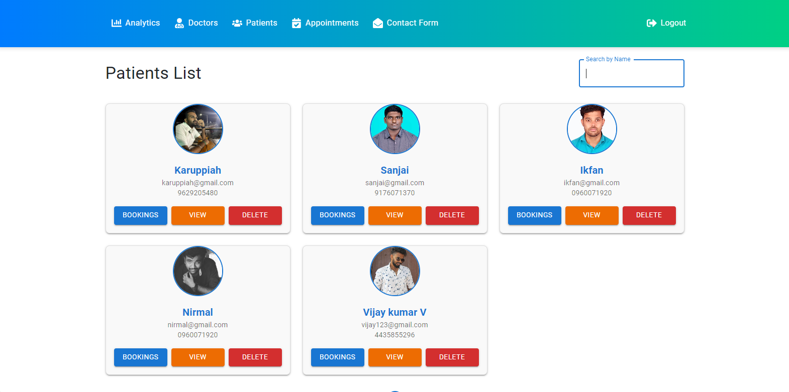

- **Manage Bookings**: Admins can view each doctor’s and patient’s bookings, and manage the status of bookings:
  - Pending
  - Booked
  - Completed
  - Cancelled
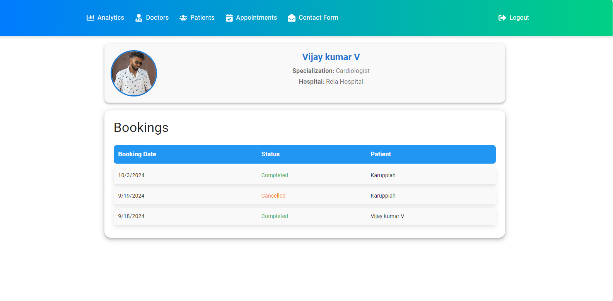
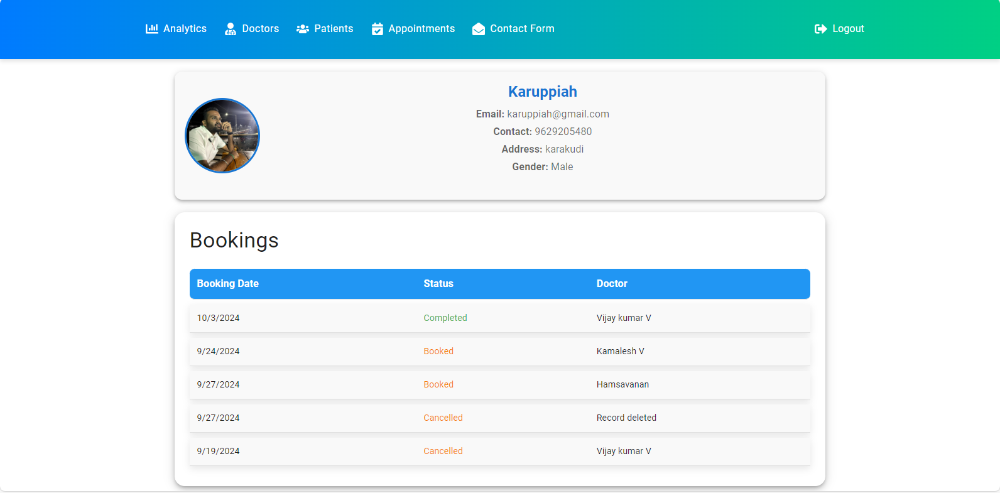
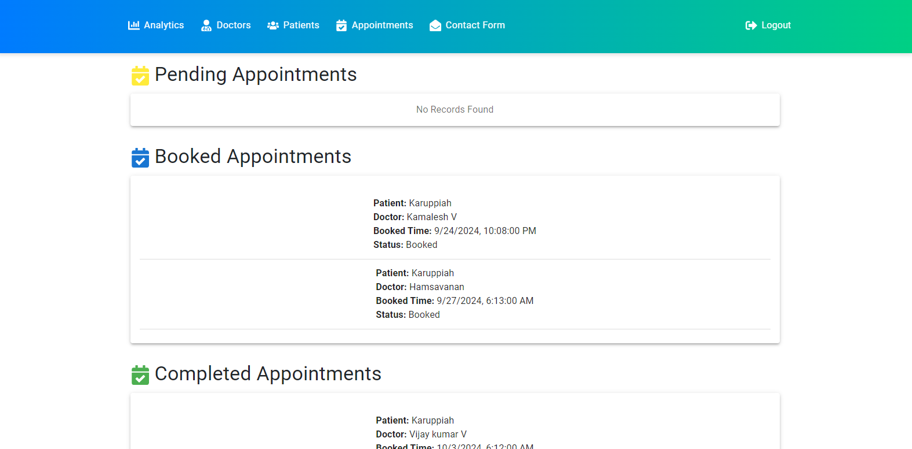
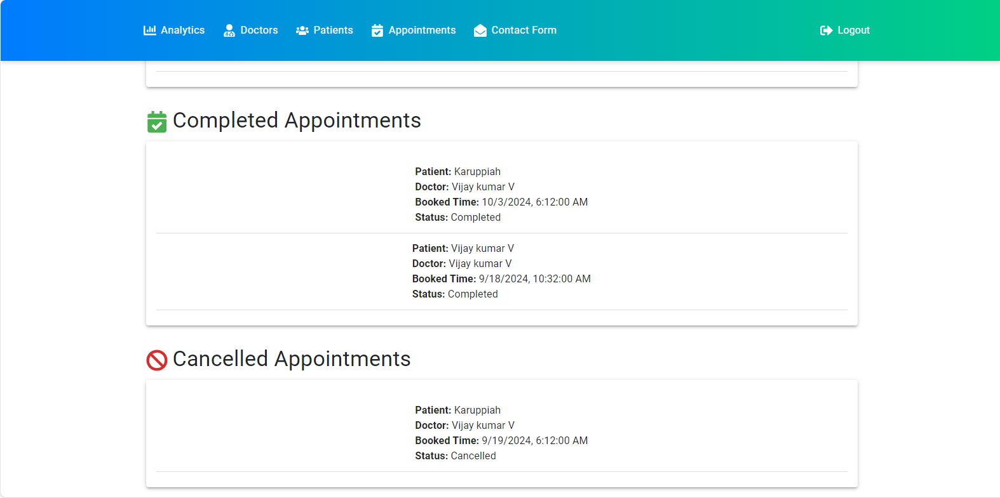


---
## Responsivne

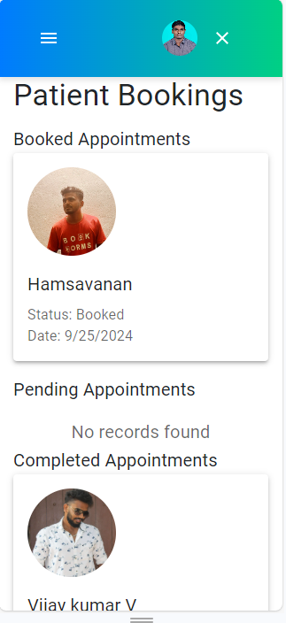
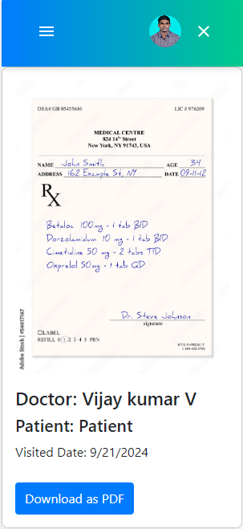
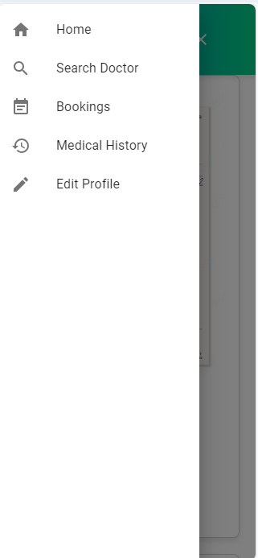


## Features Breakdown

### Patients Module
- Search for doctors by location and specialty.
- Book appointments directly from the list of available doctors.
- View and manage your own medical history.
- Edit your profile to update personal details.

### Doctors Module
- Access a directory of other doctors in the system.
- Set available dates for patient appointments.
- View and manage upcoming bookings.
- Edit your professional profile.
- Access patient medical history for better treatment.
- Upload prescriptions to complete bookings.

### Admin Module
- Comprehensive analytics dashboard to monitor system activity.
- Manage lists of doctors and patients.
- Oversee all appointments across the system.
- Update the status of appointments (cancelled, booked, completed).

---

## Frontend Dependencies

This project uses a variety of libraries and tools to manage the front-end, handle forms, manage state, and integrate with external services. Below is an explanation of each dependency used in the project.

### Main Packages

- **React (`react`, `react-dom`)**: The core libraries for building the user interface using components and rendering them in the browser.
- **react-scripts**: Scripts and configuration used by Create React App to handle development, testing, and building the project.
- **react-router-dom**: Provides routing capabilities, allowing navigation between different pages and components within the application.

### UI and Styling

- **@mui/material, @mui/icons-material**: Material-UI (MUI) is a popular React component library that provides pre-designed, customizable components and icons for building responsive interfaces.
- **@emotion/react, @emotion/styled**: Used with Material-UI to enable CSS-in-JS, allowing you to write CSS styles directly in JavaScript and apply them to React components.
- **bootstrap, react-bootstrap**: Bootstrap is a widely used CSS framework, while `react-bootstrap` integrates Bootstrap components into React as reusable components.
- **bootstrap-icons**: Provides icons that follow the Bootstrap style.
- **slick-carousel, react-slick**: Used for creating carousels or sliders, enabling the display of items (like images or cards) in a scrollable view.
- **swiper**: Another library for creating touch-friendly carousels and sliders.

### Form Handling and Validation

- **formik**: A library that simplifies form handling in React, helping manage form state, validation, and submission.
- **react-hook-form**: Another form handling library that focuses on minimal re-renders and simplicity. It integrates well with various validation libraries.
- **yup**: Used with `formik` and `react-hook-form` for form validation, allowing you to define schema-based validations.

### Data Fetching and HTTP Requests

- **axios**: A promise-based HTTP client for making API requests, allowing you to interact with external data sources and APIs.

### Notifications and User Feedback

- **react-toastify**: A library for displaying customizable toast notifications, useful for alerting users to success, error, or informational messages.

### PDF Generation

- **jspdf**: A library that allows you to generate PDF documents programmatically, useful for exporting information like prescriptions or reports.

### Icons

- **react-icons**: Provides access to various popular icon libraries directly in React components, enabling you to easily add icons to your UI.

### Miscellaneous

- **lineicons**: Another icon set used to provide additional icon styles.
- **reactstrap**: A library that provides Bootstrap 4 components for React, enabling easier UI development using familiar Bootstrap styles.

### Testing

- **@testing-library/react, @testing-library/jest-dom, @testing-library/user-event**: These libraries provide utilities for testing React components, simulating user interactions, and checking DOM output in tests.

## Installation and Setup

To run this project locally, follow the steps below:


```bash
git clone https://github.com/your-username/doctor-appointment.git
cd doctor-appointment
npm install
npm start
```

## Backend API (DotNet)

This API is built with ASP.NET Core to manage doctor appointments, including authentication and role-based authorization for admins, doctors, and patients.

## Features

- **Authentication and Authorization**: JWT Bearer authentication with role-based authorization policies (`AdminOnly`, `DoctorOnly`, `PatientOnly`).
- **Swagger/OpenAPI Integration**: API documentation and testing UI using Swagger, with JWT authentication supported in the UI.
- **Entity Framework Core**: Database interaction is managed using Entity Framework Core with a SQL Server connection.
- **CORS Policy**: Configured CORS policy to allow requests from any origin, method, and header, ensuring API accessibility.
- **Dependency Injection**: Repositories and services (`IDoctorRepository`, `JwtService`) are injected into the application using ASP.NET Core's dependency injection.
- **JSON Serialization**: The API uses `ReferenceHandler.Preserve` to handle circular references in JSON responses.
- **HTTPS Redirection**: Enforces secure communication by redirecting HTTP requests to HTTPS.
- **Swagger JWT Setup**: Configured Swagger UI to allow testing authenticated endpoints using JWT tokens.

## Installation and Setup

To run this API locally, follow these steps:

### 1. Clone the Repository

```bash
git clone https://github.com/your-username/doctor-appointment-api.git
cd doctor-appointment-api
dotnet restore
dotnet ef database update
dotnet run
```
## Conclusion
The **Doctor Appointment System** streamlines the appointment booking process for both patients and doctors, with a dedicated admin panel for management and analytics. It ensures ease of use while providing robust functionality for all users involved.